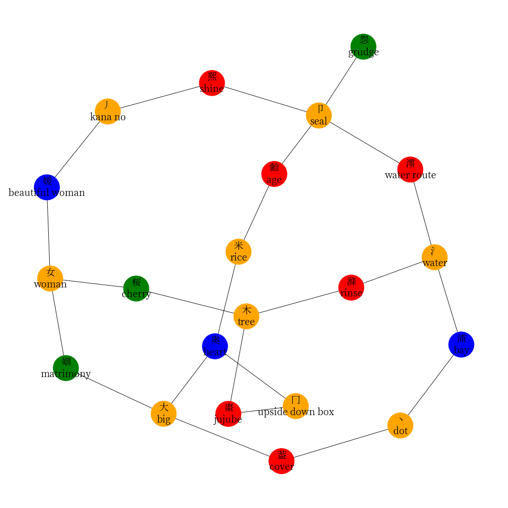
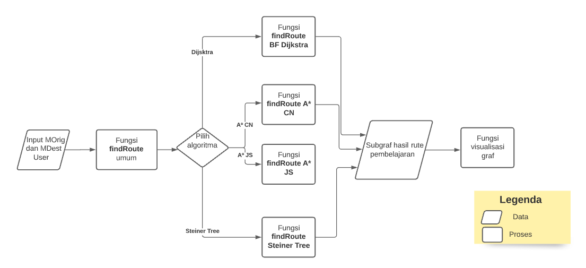

# Kanjigen



**Kanjigen** is a program that search for finding route between 2 set of kanji(a graph node). The first set of nodes is supposed as starting node, and the second set of nodes is a target.

## Installation

```bash
pip install -r requirements.txt
```

# Abstract
Kanji is the letter system used in Japanese. One of the differences between kanji and alphabet letters is that kanji can be made up of radicals, or smaller kanji parts. For example, the kanji 休(rest; retire) is composed of the radicals イ(person) and 木(tree). This arrangement also forms a story that one form of rest is a person sleeping in a tree.

The relationship between one kanji, its radical, and the other kanji can be represented by knowledge graph. To take advantage of this linkage of kanji and radicals, a route search algorithm is needed to search for kanji learning routes. We tested 3 route search algorithms, namely Dijkstra, A*, and Steiner Tree. The Steiner Tree Algorithm has a faster travel time among the three because it has a better time complexity. The Steiner Tree Algorithm has time complexity $O( (|MOrig|+|MDest|) * |Vertices_{G}|^2)$, while the Dijkstra and A* Algorithms have {time complexity} $O( (|MOrig|*|MDest|) * (|Vertices_{G}| + |Edges_{G}| ) \log{|Vertices_{G}|}))$. We found that the optimization of Steiner Tree by extracting the generation step of metricClosure and memoization accelerated the performance of the Steiner Tree Algorithm. The Steiner Tree Algorithm also has a smaller number of result nodes than Dijkstra and A*. This is because the resulting graph from the Steiner tree algorithm is certain to be in the form of tree or a graph without cycle, while the Dijkstra and A* Algorithms may produce a graph with cycle.

# Architecture


# Author
Ferdian Ifkarsyah (13517024)